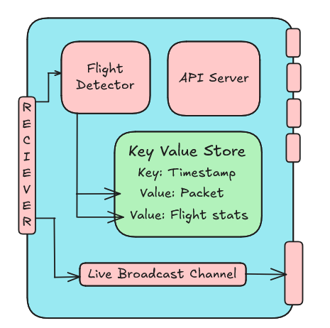

# SkyLink Telemetry Gateway

**Real-time telemetry collection, storage, and streaming for ESP32-based flight systems**



SkyLink is a production-ready Rust telemetry gateway that receives flight data from ESP32 LoRa/WiFi modules, intelligently detects flight phases, stores telemetry with a custom key-value store, and provides REST/WebSocket APIs for real-time monitoring and analysis.

---

## Features

- **Real-time Telemetry Ingestion** - TCP connection to ESP32 with automatic reconnection
- **Intelligent Flight Detection** - State machine-based flight phase detection (Ground → Takeoff → Flight → Landing)
- **Persistent Storage** - Custom append-only KV store with automatic compaction
- **REST API** - Query telemetry by time range, retrieve flight metadata, system stats
- **WebSocket Streaming** - Live telemetry broadcast to multiple clients

---

## Quick Start

### Configuration

Edit `config.toml`:

```toml
[esp32]
ip = "192.168.0.32"
port = 8888
reconnect_delay_secs = 5

[storage]
persists = true
path = "./telemetry_data"
auto_compact = true

[flight_detection]
start_altitude_m = 5.0
start_speed_ms = 2.0
min_takeoff_altitude_m = 10.0
timeout_duration_ms = 60000

[api]
host = "0.0.0.0"
port = 9091
```

### Run

**Hardware Mode** (connects to ESP32):
```bash
cargo run --example wet_run
```

**Simulation Mode** (generates test data):
```bash
cargo run --example dry_run
```

---

## Architecture

### Data Flow

1. **Ingestion** - ESP32 sends JSON packets over TCP (e.g., `{"timestamp": 1700000000, "gps": {...}, "baro": {...}}`)
2. **Detection** - `FlightDetector` analyzes altitude/speed to identify flight phases
3. **Storage** - Packets stored as `telem:{timestamp}`, flights as `flight:{id}`
4. **API** - REST endpoints serve historical data, WebSocket broadcasts live data
5. **Persistence** - Store auto-saves to disk with checksumming and compaction

### Project Structure

```
src/
├── lib.rs                  # Public API exports
├── types.rs                # Core data types
├── error.rs                # Error handling
├── store.rs                # KV store implementation
├── iterator.rs             # Store iteration
├── serialization/          # Binary encoding/decoding
│   ├── header.rs           # Packed binary headers
│   ├── key.rs              # Key serialization
│   └── value.rs            # Value serialization
├── telemetry/              # Flight telemetry domain
│   ├── config.rs           # Configuration loading
│   ├── types.rs            # Telemetry packet types
│   ├── detector.rs         # Flight phase detection
│   └── simulator.rs        # Test data generation
└── api/                    # REST/WebSocket API
    ├── server.rs           # Axum server setup
    ├── handlers.rs         # HTTP request handlers
    └── websocket.rs        # WebSocket streaming

examples/
├── wet_run.rs              # Hardware mode (ESP32 connection)
└── dry_run.rs              # Simulation mode (automated testing)

Frontend/                   # Web dashboard (see Frontend/README.md)
```

---

## API Reference

### REST Endpoints

#### Get Telemetry Range
```http
GET /api/telemetry?start=1700000000&end=1700010000&limit=100
```

**Response:**
```json
{
  "count": 100,
  "packets": [
    {
      "timestamp": 1700000000,
      "seq": 1,
      "phase": "GROUND",
      "gps": { "lat": 37.7749, "lon": -122.4194, "alt": 10.5, "speed": 0.0 },
      "baro": { "alt": 10.2, "vspeed": 0.0, "temp": 25.0 },
      "imu": { "roll": 0.0, "pitch": 0.0, "yaw": 0.0 },
      "battery": { "voltage": 12.6, "current": 0.5 }
    }
  ]
}
```

#### Get Single Packet
```http
GET /api/telemetry/1700000000
```

#### Get All Flights
```http
GET /api/flights
```

**Response:**
```json
{
  "flights": [
    {
      "flight_id": "flight_001",
      "start_time": 1700000000,
      "end_time": 1700001200,
      "duration_secs": 1200,
      "packet_count": 120,
      "max_altitude": 300.0,
      "min_altitude": 10.0,
      "ended_normally": true,
      "min_battery": 11.2
    }
  ]
}
```

#### Get Flight by ID
```http
GET /api/flights/flight_001
```

#### Delete Flight
```http
DELETE /api/flights/flight_001
```

#### Get System Stats
```http
GET /api/stats
```

**Response:**
```json
{
  "total_packets": 1500,
  "total_flights": 3,
  "oldest_timestamp": 1700000000,
  "newest_timestamp": 1700010000,
  "storage_size_bytes": 245760
}
```

### WebSocket Streaming

Connect to live telemetry stream:

```javascript
const ws = new WebSocket('ws://localhost:9091/ws/telemetry');

ws.onmessage = (event) => {
  const packet = JSON.parse(event.data);
  console.log(`Alt: ${packet.baro.alt}m, Speed: ${packet.gps.speed}m/s`);
};
```

---

## Flight Detection

### State Machine

```
GROUND ──▶ TAKEOFF ──▶ FLIGHT ──▶ LANDING ──▶ GROUND
   ▲                                            │
   └────────────────────────────────────────────┘
```

### Detection Logic

**Takeoff Detected:**
- Altitude > `start_altitude_m` (default: 5m)
- Speed > `start_speed_ms` (default: 2 m/s)

**Landing Detected:**
- Altitude < `end_altitude_m` (default: 5m)
- Speed < `end_speed_ms` (default: 2 m/s)
- Stable for `ground_stable_duration_ms` (default: 5s)

**Timeout Detection:**
- No packets for `timeout_duration_ms` (default: 60s)
- Flight marked as abnormal termination

**Taxiing Filter:**
- Flights below `min_takeoff_altitude_m` (default: 10m) are discarded
- Prevents false positives from ground movement

---

## Storage Engine

SkyLink uses a custom append-only key-value store optimized for telemetry workloads.

### Key Design

For detailed information about the storage engine, see the [Store Documentation](#kv-store-documentation) section below.

**Quick Overview:**
- **Append-only writes** - O(1) insertion, no locks during writes
- **HashMap index** - O(1) lookups by timestamp
- **Automatic compaction** - Reclaims space when fragmentation > 35%
- **Crash-safe persistence** - CRC32 checksums, atomic writes
- **Efficient iteration** - Range queries without loading all data

### Data Model

```
Key Format:
  telem:{timestamp}  → TelemetryPacket (JSON)
  flight:{id}        → FlightMetadata (JSON)

Example:
  telem:1700000000 → {"timestamp": 1700000000, "gps": {...}, ...}
  flight:flight_001 → {"flight_id": "flight_001", "max_altitude": 300.0, ...}
```

---

## Testing

### Run All Tests
```bash
cargo test
```

### Quality Check Script
```bash
./check.sh
```

Runs:
- `cargo fmt --check` - Code formatting
- `cargo clippy` - Linter
- `cargo test` - All 28 unit tests

### Dry Run Verification

The `dry_run` example provides automated end-to-end testing:

```bash
cargo run --example dry_run
```

**Validates:**
1. Simulates 120 telemetry packets (full flight profile)
2. Flight detection triggers correctly
3. All REST endpoints return expected data
4. WebSocket streaming works
5. Storage persistence and retrieval

---

## Roadmap

### Upcoming Features

**Hardware Integration**
- Complete telemetry box assembly guide with wiring diagrams
- ESP32 firmware configuration and flashing instructions
- LoRa module setup and range testing procedures
- Power management and battery integration

**MATLAB Analysis GUI**
- Real-time telemetry visualization dashboard
- Flight path 3D plotting and replay
- Performance metrics analysis (max altitude, speed, G-forces)
- Data export for post-flight analysis
- Integration with WebSocket live stream

---

## Performance

### Software Performance

SkyLink's Rust implementation provides high throughput that far exceeds typical hardware capabilities:

- **Storage Throughput**: ~1.15M ops/sec (KV store stress test)
- **Telemetry Processing**: ~10,000+ packets/sec (single-threaded)
- **API Latency**: <5ms for single packet retrieval
- **WebSocket Broadcast**: 100+ concurrent clients
- **Memory Usage**: ~50MB for 10,000 packets + index

### System Bottleneck: Hardware, Not Software

**The ESP32 hardware is the bottleneck**, not the SkyLink gateway software:

- **ESP32 Telemetry Rate**: 10-20 packets/second (typical configuration)
  - Limited by LoRa bandwidth (SF7-SF12 modulation)
  - Constrained by sensor update rates (IMU, GPS, Barometer)
  - WiFi mode can achieve 50-100 Hz but still hardware-limited

- **Performance Headroom**: SkyLink can handle **500x more telemetry** than a single ESP32 provides
  - Software capacity: 10,000 packets/sec
  - Hardware output: ~20 packets/sec
  - **Multi-device support**: Can easily handle 10+ ESP32 devices simultaneously

**Optimization Priority**: The gateway has massive headroom and will not be a performance bottleneck in real-world deployments.

---

## License

This is a learning project. Use it however you want.

---

## Contributors

### Backend System (SkyLink Gateway)
- **Mihir Kumar Patel** (1123669) - Lead Developer
  - Core telemetry gateway implementation
  - KV store design and optimization
  - Flight detection state machine
  - REST/WebSocket API architecture

### Frontend (Dashboard)


---

## Acknowledgments

- Built with [Axum](https://github.com/tokio-rs/axum) for the REST/WebSocket API
- Uses [Tokio](https://tokio.rs/) for async runtime
- Configuration via [config-rs](https://github.com/mehcode/config-rs)
- Error handling with [thiserror](https://github.com/dtolnay/thiserror)

---
